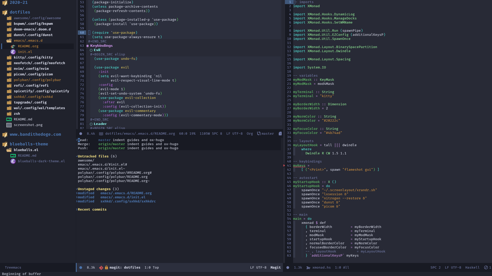

# blueballs for Emacs

**Yet another blue-ish theme for Emacs**

Modes visible in the screenshot: `solaire-mode`, `highlight-indent-guides-mode` `doom-modeline`, `treemacs`, `magit`, `org-mode`, `org-indent-mode`, `haskell-mode`

## Supported modes
- [doom-modeline](https://github.com/seagle0128/doom-modeline)
- [rainbow-delimiters](https://github.com/Fanael/rainbow-delimiters)
- [Treemacs](https://github.com/Alexander-Miller/treemacs)
- [Ivy](https://github.com/abo-abo/swiper)
- [which-key](https://github.com/justbur/emacs-which-key)
- [Company](http://company-mode.github.io/)
- [Dashboard](https://github.com/emacs-dashboard/emacs-dashboard)
- [Flycheck](https://www.flycheck.org/en/latest/)
- [flycheck-inline](https://github.com/flycheck/flycheck-inline)
- [Org](https://orgmode.org/)
- [Magit](https://magit.vc/) (partial)
- [web-mode](https://web-mode.org/)
- [Monkeytype](https://github.com/jpablobr/emacs-monkeytype)
